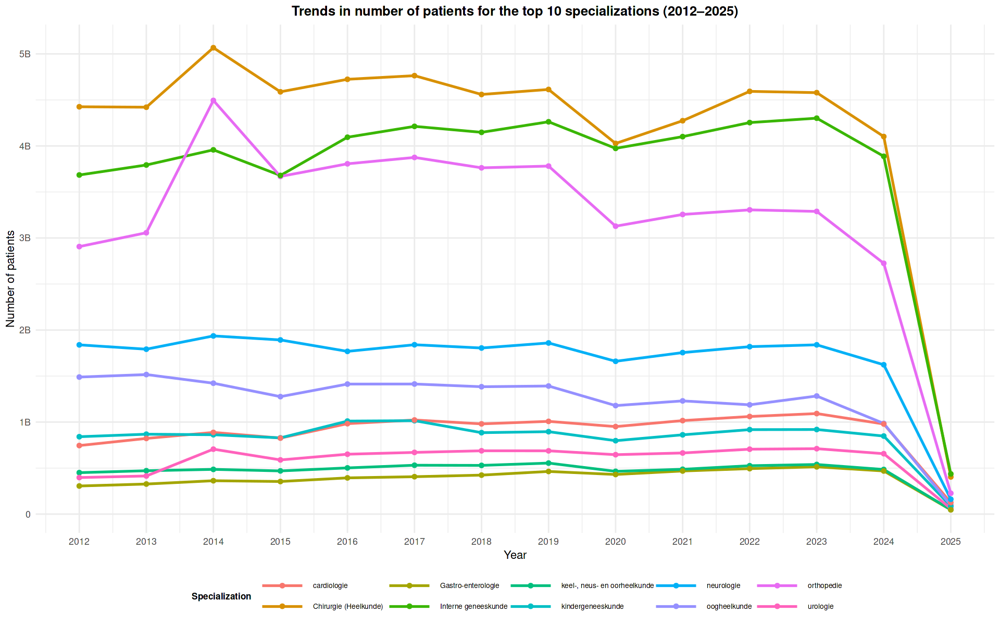

# healthcare-trends-nl
Analysis of Dutch healthcare trends (2012–2025): diagnoses, specialisations, and costs

This project analyses **healthcare trends in the Netherlands**, focusing on:
- Most common diagnoses and how they change over time
- Specialisations with the highest workload
- Cost of treatment by specialisation and product

📊 **Full analysis available on Kaggle:**  
➡ [Click to view the project on Kaggle](https://www.kaggle.com/code/marialukash/healthcare-trends-in-the-netherlands-2012-2025/)

---
## Define the problem

**Business context:**  
This analysis explores trends in Dutch healthcare based on open data from the NZa (Nederlandse Zorgautoriteit).  
Healthcare costs and patient volumes are key topics in the Netherlands due to an aging population and rising care demand.

**Goal:**  
To identify trends in patients, costs, and medical specialisations between 2012–2025.

**Key questions:**
1. Which diagnoses are the most common, and how do they change over time?  
2. Which specialisations handle the largest number of patients?  
3. Where are treatments the most expensive?
---
## 🗂 Data source

The data come from the **Open DIS dataset**, published by the  
[Nederlandse Zorgautoriteit (NZa)](https://www.nza.nl/) via the official Dutch open data portal:  
👉 [Overheid.nl – Open DIS data](https://data.overheid.nl/dataset/open-dis-data)

**Key features of the dataset:**
- 📌 *License:* Public domain (Publiek domein)  
- 🏥 *Provider:* Nederlandse Zorgautoriteit (NZa)  
- 🇳🇱 *Coverage:* Aggregated hospital care data in the Netherlands  
- 🔒 *Privacy:* Fully anonymised and publicly available  

### Files used in this project:
1. `DBC-Zorgproducten per jaar, specialisme, diagnose` – main dataset containing patient counts, diagnoses, specialisations, and average prices.  
2. `Referentietabel zorgproducten` – reference table for treatment products.  
3. `Referentietabel specialismen` – reference table for medical specialisations.  
4. `Referentietabel diagnoses` – reference table for diagnoses.  
---

## ⚙️ Tools
- R (readr, dplyr, ggplot2)
- Jupyter / Kaggle Notebooks
- GitHub for version control

## 📈 Key Insights
### **1. Top 10 Most Common Diagnoses Per Year (2012–2025)**
This chart shows the most frequently diagnosed medical conditions per year, highlighting cardiovascular and oncological disorders as consistently dominant.

---

### **2. Trends in Patient Volume for Top Diagnoses (2012–2025)**
This line graph visualizes how patient numbers evolved over time for the leading diagnoses, showing a significant upward trend in heart-related and chronic conditions.

---

### **3. Top 10 Medical Specialisations by Patient Volume**
This visualization compares the most visited specialisations annually, with Surgery and Internal Medicine consistently ranking highest.

---

### **4. Long-Term Trends in Specialisation Workload (2012–2025)**
This chart shows how the demand for specialisations has changed over time, with a clear increase in cardiology and rehabilitation services.

---

### **5. Top 10 Most Expensive Specialisations**
This chart presents the specialisations with the highest treatment costs per year, dominated by cardiothoracic surgery and cardiology.

---

### **6. Long-Term Trends in Healthcare Expenditure**
This line graph highlights how treatment costs evolved across years, emphasizing a consistent rise in cardiovascular-related expenses.

---

## 🔍 Insights and Trend Interpretation

### 🔹 1. Cardiovascular Disorders / Hart- en vaatziekten
Cardiovascular diagnoses such as atrial fibrillation and chronic heart failure show a steady increase between 2012 and 2024. This trend reflects the ageing of the population, improvements in diagnostic accuracy, and greater awareness of heart-related conditions.

### 🔹 2. Oncological & Dermatological Conditions / Oncologische en dermatologische aandoeningen
Malignant skin neoplasms demonstrate a continuous upward trend, especially after 2015. This suggests increased prevalence as well as improved early detection and heightened public awareness of skin cancer risks.

### 🔹 3. Top Specializations by Patient Volume / Meest bezochte specialismen
Surgery, Internal Medicine, and Orthopedics consistently rank among the top specializations. The demand for surgical care remains high, Internal Medicine grows due to chronic diseases, and Orthopedics shows a decline likely due to a shift towards rehabilitation and preventive therapies.

### 🔹 4. Highest-Cost Specializations / Specialismen met de hoogste kosten
The highest healthcare costs are concentrated in cardiothoracic surgery, cardiology, and rehabilitation. These areas involve complex and resource-intensive treatments, reflecting the increasing burden of cardiovascular diseases in the Netherlands.

### 🔹 5. General Healthcare Trend / Algemene trend in de gezondheidszorg
Across all categories, long-term growth is primarily driven by an ageing population and improved access to healthcare. Many trends represent not only a true increase in disease prevalence but also better reporting and diagnostic practices.

## ✅ Conclusions & Recommendations

### **Conclusions**
The analysis of Dutch healthcare data from 2012–2024 reveals a clear long-term increase in both patient volume and treatment costs, particularly within cardiovascular care and oncological specialties. These trends are primarily driven by demographic aging, improved access to healthcare, and enhanced diagnostic capabilities. Surgical and internal medicine specializations consistently manage the highest number of patients, while cardiothoracic surgery, cardiology, and rehabilitation account for the majority of healthcare expenditures.

### **Recommendations**
- **💓 Increase investment in cardiovascular prevention and management**  
  Early intervention can reduce long-term treatment costs and improve patient outcomes.
- **🏥 Expand capacity in high-demand medical specialisations**  
  Particularly in surgery and internal medicine, where patient volume remains consistently high.
- **🧑‍⚕️ Prioritise rehabilitation infrastructure**  
  Rising survival rates after major procedures lead to long-term demand for rehabilitation care.
- **🧬 Improve early detection and awareness programs for oncology**  
  Continuous growth in skin cancer cases highlights the need for screening and prevention strategies.
